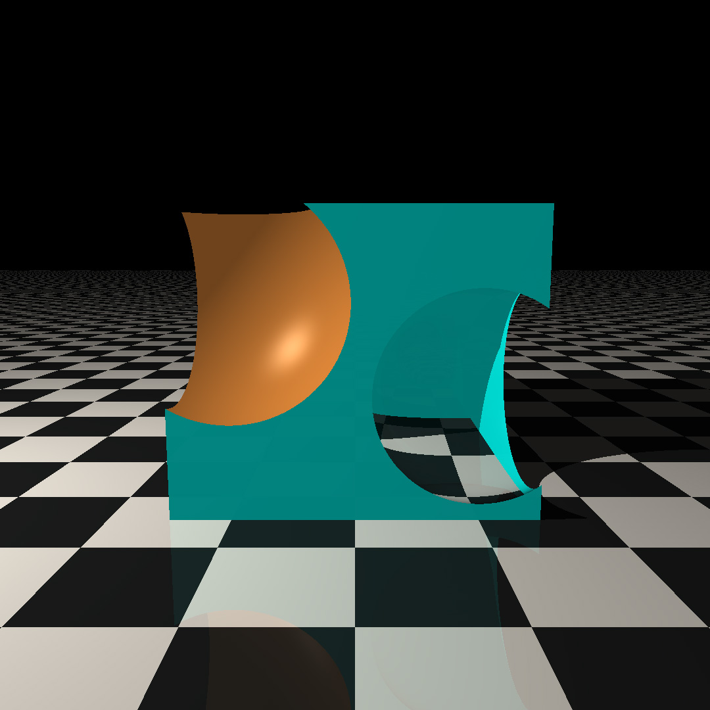
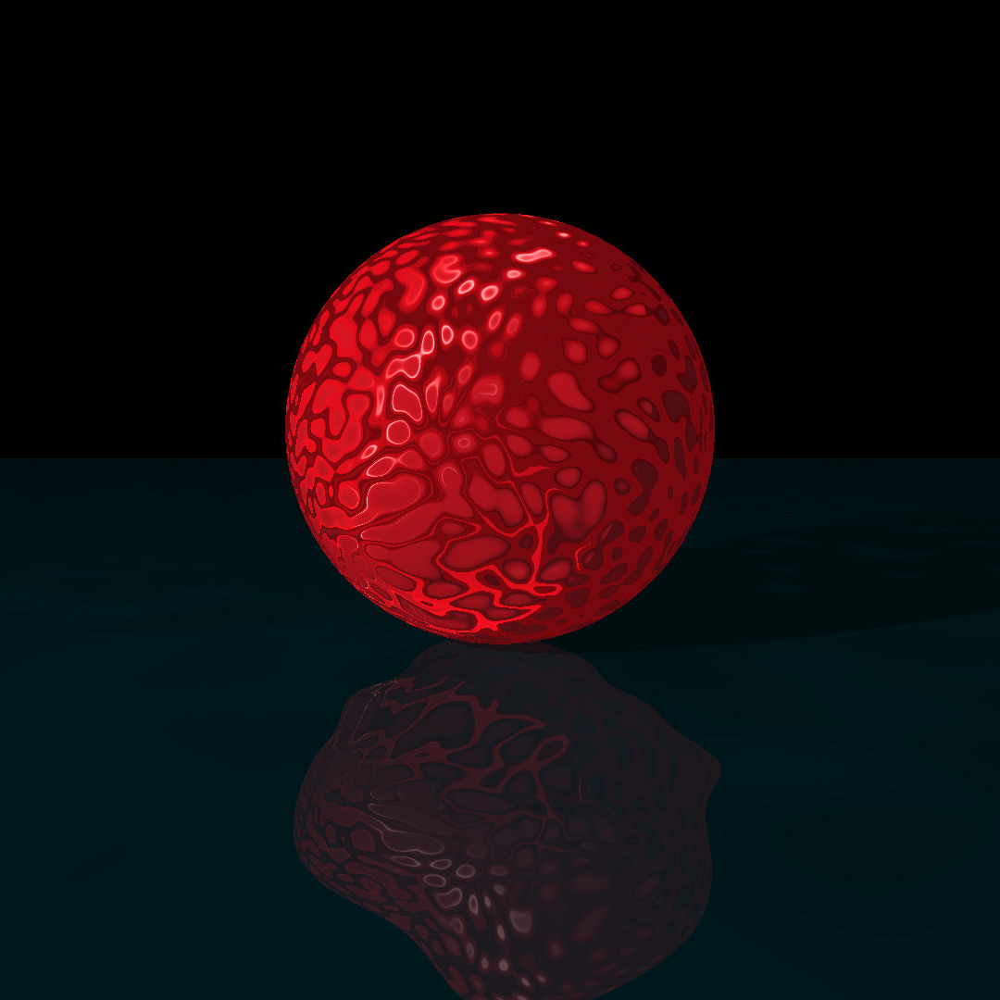

## Features

The current featureset includes

- Software (CPU-bound) **rendering** (multithreading works but is still in progress)
- **Primitive shapes** (eg: cubes, spheres, planes, triangles/polygons)
- **3D file import** (`.obj` files supported)
- Compound **(grouped) geometry** via set operations (unions, intersections, etc.)
- **Generative textures** via surface normal perturbation (using Simplex/Perlin Noise)
- A "from scratch" **Matrix and vector maths** library 
- Material properties including RGB colour, **transparency**, **reflection**, **refraction**, diffusion, etc.
- **Unit testing** with GoogleTest

## References

Ray Painter began as my attempt at the [Raytracer Challenge by Jamis Buck](http://raytracerchallenge.com/). This is one of the most fun programming texts I've worked through. The theory is presented, along with a set of language-agnostic test cases, and you are left to implement the application with no other hints from the author. Highly recommend picking up a copy if this stuff interests you!

## Source code

The `libraytracer` source code can be found at [my Git repository](https://github.com/stacygaudreau/raytracer).

## Example renders

Below are some of my favourite renders that have come out of playing with the library during development.

### Advanced surface material properties

A demo scene of advanced surface material properties including transparency, refraction, and reflectivity.

### Composite shapes

Using set operations to perform unions and intersections with multiple shapes.

### Generative textures

The latest addition is getting surface normal textures working, in order to produce generative textures with [Perlin/Simplex noise](https://en.wikipedia.org/wiki/Perlin_noise). The results are pretty cool.

## Theory

[Raytracing](https://en.wikipedia.org/wiki/Ray_tracing_(graphics)) is a 3D graphics technique used to render scenes with realistic looking lighting and other effects which simulate the way 3D objects and lighting behave in the world around us. 

It's not a new technique, having its roots in computing as early as the 1960s. I claim zero responsibility for its invention or innovation! Nevertheless, it's a very fun way to learn about 3D graphics and to embolden linear algebra programming techniques.

\ Wikipedia says it better than I can
> The ray-tracing algorithm builds an image by extending [casting] rays [vectors] into a scene and bouncing them off surfaces and towards sources of light to approximate the color value of pixels ([wikipedia](https://en.wikipedia.org/wiki/Ray_tracing_(graphics)))

It turns out that you can do a lot of interesting visual effects with the ray while it travels along its path, and this is the idea of a raytracing renderer!

## For more detail

I won't repeat everything Wikipedia says on the subject so [check out the source code for more detail](https://github.com/stacygaudreau/raytracer) if you haven't already!

_This project writeup will be extended as more features and the GUI are developed!_

